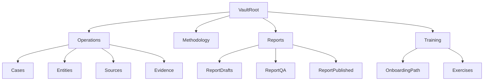

# Obsidian Vault Expansion Plan

## Expansion Goals
Build the next iteration of this vault so it supports all priorities simultaneously:
- team operations and quality control
- deeper investigation methodology
- faster reporting delivery in ENG/UKR
- structured onboarding and analyst training

## Current Baseline (Already In Place)
- Unified vault structure and onboarding docs are available in [`/home/atlas/Repos/obsidian-osint-templates/README.md`](/home/atlas/Repos/obsidian-osint-templates/README.md) and [`/home/atlas/Repos/obsidian-osint-templates/01_QuickStart.md`](/home/atlas/Repos/obsidian-osint-templates/01_QuickStart.md).
- Template insertion is configured via [`/home/atlas/Repos/obsidian-osint-templates/.obsidian/templates.json`](/home/atlas/Repos/obsidian-osint-templates/.obsidian/templates.json).
- Current balanced starter plugin set exists in [`/home/atlas/Repos/obsidian-osint-templates/.obsidian/community-plugins.json`](/home/atlas/Repos/obsidian-osint-templates/.obsidian/community-plugins.json).

## Best Practices To Introduce
- **Information architecture discipline**: enforce a small set of top-level domains (`Cases`, `Entities`, `Sources`, `Evidence`, `Reports`, `Training`) and keep templates immutable.
- **Metadata contract**: standardize frontmatter schema across all operational notes (`case_id`, `status`, `assignee`, `priority`, `language`, `source_reliability`, `verification_state`, `last_reviewed`).
- **Naming and IDs**: use deterministic IDs (`case-YYYYMMDD-<slug>`, `ent-person-<slug>`, `src-<platform>-<slug>`) to stabilize links and reduce duplicates.
- **Review workflow**: add explicit review checkpoints (peer review, legal/compliance check, final signoff) before report export.
- **Evidence traceability**: every analytical claim links to at least one source note and one evidence artifact note.
- **Operational hygiene**: maintain a regular index/coverage audit cycle and changelog notes for template updates.

## Balanced Plugin Stack (Recommended)
Keep current plugins and add a limited, high-value set.

### Keep (already configured)
- `obsidian-tasks-plugin`
- `obsidian-map-view`
- `obsidian-leaflet-plugin`

### Add next (balanced profile)
- **Dataview**: dynamic dashboards for case status, stale notes, missing metadata.
- **QuickAdd**: guided capture commands (new case, new source, new entity) with consistent IDs.
- **Templater**: advanced template logic (date stamps, role/language variants, conditional fields).
- **Metadata Menu** (or equivalent metadata editor): enforce frontmatter consistency for non-technical users.
- **Kanban**: lightweight workflow board for report production and case progression.
- **Periodic Notes** (optional): structured daily/weekly analyst logs and handoff notes.

### Plugin governance tactics
- Maintain a plugin allowlist and version lock policy in docs.
- Prefer plugins with active maintenance and low lock-in risk.
- Add a “degrade gracefully” note for each plugin (what still works if plugin is disabled).

## Tactics By Objective

### 1) Team Operations
- Create role-based dashboards (Lead, Analyst, Reviewer) powered by Dataview queries.
- Add `Handoffs/` and `ReviewQueues/` folders with standard templates.
- Define a triage protocol: intake -> assignment -> investigation -> review -> publish.

### 2) Methodology Depth
- Expand `Methodology/` into modular playbooks: identity, infra, geolocation, sanctions, media verification, dark web.
- Add decision trees and confidence scoring guidance per playbook.
- Introduce “minimum evidence threshold” checklist per report type.

### 3) Reporting Delivery
- Create report build pipelines in notes: draft -> QA -> approved -> exported.
- Add bilingual report skeleton bundles and terminology glossary (ENG/UKR) for consistency.
- Introduce reusable “Findings blocks” and “Risk statements” libraries.

### 4) Training and Onboarding
- Build `Training/` track with progressive exercises using `Examples/`.
- Add certification checklists per analyst level (junior/intermediate/senior).
- Include a “first 7 days” onboarding path linked from home.

## Proposed Expansion Structure

## Implementation Phases
- **Phase 1 (foundation)**: finalize metadata schema, add QuickAdd/Templater workflows, create core operational folders.
- **Phase 2 (workflows)**: implement dashboards, review queues, report lifecycle templates, bilingual glossary.
- **Phase 3 (methodology)**: expand playbooks and evidence threshold checklists.
- **Phase 4 (enablement)**: launch training path, exercises, and role-based onboarding.
- **Phase 5 (governance)**: plugin governance docs, maintenance routines, quarterly vault audit checklist.

## Validation Criteria
- New cases can be created in under 2 minutes with complete metadata.
- At least 90% of active case notes appear in status dashboards.
- Every published report has linked evidence and reviewer signoff.
- New analyst can complete onboarding path without facilitator intervention.

## Primary Files To Evolve First
- [`/home/atlas/Repos/obsidian-osint-templates/00_Home.md`](/home/atlas/Repos/obsidian-osint-templates/00_Home.md)
- [`/home/atlas/Repos/obsidian-osint-templates/01_QuickStart.md`](/home/atlas/Repos/obsidian-osint-templates/01_QuickStart.md)
- [`/home/atlas/Repos/obsidian-osint-templates/Methodology/_index.md`](/home/atlas/Repos/obsidian-osint-templates/Methodology/_index.md)
- [`/home/atlas/Repos/obsidian-osint-templates/ReportTemplates/_index.md`](/home/atlas/Repos/obsidian-osint-templates/ReportTemplates/_index.md)
- [`/home/atlas/Repos/obsidian-osint-templates/.obsidian/community-plugins.json`](/home/atlas/Repos/obsidian-osint-templates/.obsidian/community-plugins.json)
- [`/home/atlas/Repos/obsidian-osint-templates/README.md`](/home/atlas/Repos/obsidian-osint-templates/README.md)
