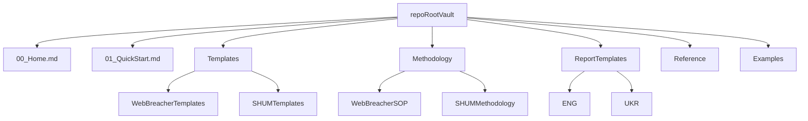

# Combine WebBreacher + SHUM Into One Vault

## Goal
Create a single Obsidian vault at repo root that:
- keeps both source corpora intact (no destructive merge)
- offers a clean onboarding path for investigators
- separates reusable templates, SOP/methodology, and reporting packs
- remains easy to `git clone` and open immediately in Obsidian

## Proposed Information Architecture

## Source Mapping (Side-by-Side Preservation)
- Preserve content from [`/home/atlas/Repos/obsidian-osint-templates/WebBreacher originals`](/home/atlas/Repos/obsidian-osint-templates/WebBreacher%20originals) under namespaced folders like `Templates/WebBreacherTemplates` and `Methodology/WebBreacherSOP`.
- Preserve content from [`/home/atlas/Repos/obsidian-osint-templates/SHUM`](/home/atlas/Repos/obsidian-osint-templates/SHUM) under `Templates/SHUMTemplates`, `Methodology/SHUMMethodology`, and `ReportTemplates/{ENG,UKR}`.
- Keep current SHUM bilingual split visible because files already exist in parallel in [`/home/atlas/Repos/obsidian-osint-templates/SHUM/ENG/MD`](/home/atlas/Repos/obsidian-osint-templates/SHUM/ENG/MD) and [`/home/atlas/Repos/obsidian-osint-templates/SHUM/UKR/MD`](/home/atlas/Repos/obsidian-osint-templates/SHUM/UKR/MD).

## Navigation and Discoverability
- Add a root landing note (`00_Home.md`) with:
  - purpose + intended use cases
  - “Start here” links for new users
  - source-attribution section for WebBreacher and SHUM
- Add a quick-start note (`01_QuickStart.md`) with clone/open steps, recommended plugins, and first workflow.
- Add index notes for each major section (`Templates/_index.md`, `Methodology/_index.md`, `ReportTemplates/_index.md`) to avoid dependency on graph-view discovery.

## Obsidian Configuration Consolidation
- Keep one `.obsidian` directory at root based on stable settings from WebBreacher config in [`/home/atlas/Repos/obsidian-osint-templates/WebBreacher originals/.obsidian`](/home/atlas/Repos/obsidian-osint-templates/WebBreacher%20originals/.obsidian).
- Reduce plugin fragility by:
  - retaining only essential plugin references from [`community-plugins.json`](/home/atlas/Repos/obsidian-osint-templates/WebBreacher%20originals/.obsidian/community-plugins.json)
  - removing machine-specific layout files from tracked defaults (`workspace`/`workspace.json` style files)
- Update template folder setting (currently `-- templates` in [`templates.json`](/home/atlas/Repos/obsidian-osint-templates/WebBreacher%20originals/.obsidian/templates.json)) to the new canonical templates location.

## Content Normalization Rules (Non-destructive)
- Do not overwrite either source’s note content; instead add explicit source tags/frontmatter, e.g. `source: webbreacher` or `source: shum`.
- Standardize folder names, while leaving note titles unchanged where possible to preserve semantics and backlinks.
- Normalize obvious path inconsistencies (e.g. attachment path naming drift from old settings) only after content is placed.

## README and Repository UX
- Refactor [`/home/atlas/Repos/obsidian-osint-templates/README.md`](/home/atlas/Repos/obsidian-osint-templates/README.md) to describe:
  - final unified vault structure
  - side-by-side curation policy
  - language support (ENG/UKR)
  - attribution and license continuity
- Add “What changed from upstream WebBreacher” and “How SHUM pack fits in” sections.

## Acceptance Criteria
- A fresh `git clone` opens as one Obsidian vault at repo root.
- Users can find all WebBreacher originals and SHUM templates via section indexes within 2 clicks.
- No source material is lost; both corpora remain clearly labeled.
- Root README matches on-disk structure and onboarding flow.
- Default `.obsidian` config is portable and does not depend on a specific local workspace layout.
